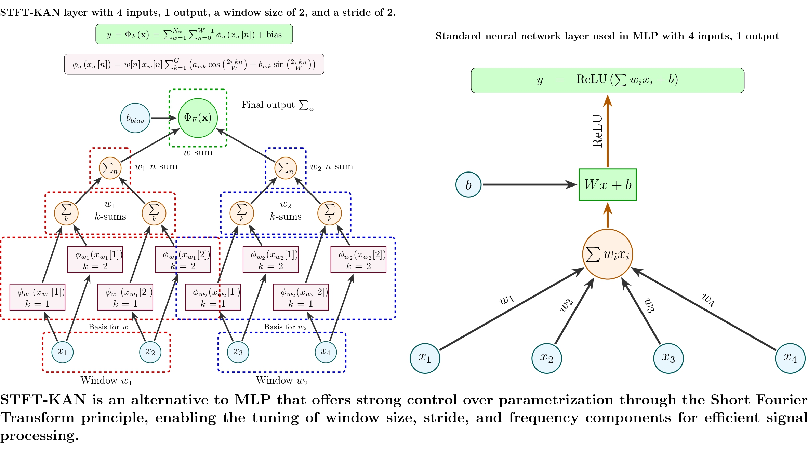

# STFT-KAN Framework

## Overview

We propose a new **Kolmogorov-Arnold Network (KAN)**, called **STFT-KAN**, which introduces **Short-Time Fourier Transform (STFT)** into KAN. The **STFT-KAN framework** allows for the use of different window sizes across various frequency ranges, providing a more adaptable and efficient way to represent underlying signals by capturing nonstationary frequency characteristics. This enhanced Fourier-based KAN formulation offers better control over model parameters, reducing the risk of overfitting while preserving performance similar to that of the original KAN model.



We have two sections: the first section [STFT-KAN Benchmarking](#stft-kan-benchmarking) focuses on evaluating STFT-KAN on general tasks like MNIST digit classification. The second section [Paper Implementation Code](#paper-implementation-code) details the method introduced in our paper, where STFT-KAN is applied to 3D point cloud classification of tree species using Dynamic Graph CNN (DGCNN).

---

## STFT-KAN Benchmarking

### STFT-KAN on MNIST

To experiment with **STFT-KAN** on a general task like **MNIST digit classification**, execute:
```bash
cd "STFT-KAN Benchmarking"  
python mnist.py
```
In this example, we use the same architecture for all layers to classify MNIST digits after feature extraction using a pretrained ResNet18. Note that our goal is to demonstrate how STFT-KAN is flexible in complexity control, so we choose the hyperparameters of other KAN models in a way that minimizes the parameter count. For the MLP, we use ReLU activation.

This table represents the results with different parameter combinations for STFT-KAN: STFTKANlayer (grid_size, window_size, stride).


|LayerType              |Best_Epoch|Best_Train_Accuracy|Best_Test_Accuracy|Num_Params|Train_Time_sec    |
|-----------------------|----------|-------------------|------------------|----------|------------------|
|MLP                    |28        |0.9961             |**0.9811**            |**33482**     |33.37             |
|KANLayer               |40        |0.9998             |0.9801            |66966     |48.80             |
|KALNLayer              |39        |0.9962             |0.9807            |66964     |47.45             |
|GRAMLayer              |39        |0.9961             |0.9823            |66966     |47.44             |
|FastKANLayer           |39        |1.0000             |0.9808            |101450    |49.52             |
|WavKANLayer            |31        |0.9998             |0.9829            |133780    |113.75            |
|ChebyKAN               |30        |0.9924             |0.9799            |66964     |45.42             |
|BernsteinKANLayer      |32        |0.9941             |0.9803            |66964     |46.40             |
|NaiveFourierKANLayer   |35        |0.9990             |0.9817            |66890     |44.70             |
|STFTKANLayer(3,40,5)   |40        |0.9540             |0.9506            |36854     |54.91             |
|STFTKANLayer(2,40,10)  |39        |0.9298             |0.9296            |12482     |54.95             |
|STFTKANLayer(6,50,9)   |37        |0.9630             |0.9582            |40250     |55.28             |
|STFTKANLayer(5,50,10)  |40        |0.9572             |0.9564            |30354     |54.97             |
|STFTKANLayer(7,60,10)  |30        |0.9582             |0.9565            |41430     |55.28             |
|STFTKANLayer(20,60,10) |27        |0.9814             |0.9747            |118234    |65.11             |
|STFTKANLayer(12,60,5)  |31        |0.9749             |0.9685            |140090    |89.28             |
|STFTKANLayer(40,160,20)|35        |0.9728             |0.9687            |93034     |83.69             |
|**STFTKANLayer(10,20,20)** |37        |0.9818             |**0.9728**            |**32674**     |55.24             |
|STFTKANLayer(5,20,20)  |39        |0.9688             |0.9643            |16374     |53.50             |
|STFTKANLayer(5,20,25)  |37        |0.9603             |0.9563            |13074     |53.21             |
|STFTKANLayer(5,20,22)  |34        |0.9647             |0.9615            |15094     |52.89             |

We can see that even though STFT-KAN does not use nonlinear complex transformations, we can find hyperparameters that minimize the parameter count compared to other KANs, while still achieving competitive accuracy with MLP.

## Paper implementation code

### How to Execute

1. **Download Dataset:**
   - We already have a **preprocessed dataset**, it is stored in the `data` folder in **h5 format**.
   - Else, you can preprocess the dataset **STPCTLS** used in this study, which is publicly available and can be accessed via the following link: [STPCTLS Dataset](https://data.goettingen-research-online.de/dataset.xhtml?persistentId=doi:10.25625/FOHUJM).

2. **Set up the environment:**
   - This project uses **PyTorch 2.4.1** with **CUDA 11.8**. Ensure you have the required dependencies by installing from the `requirements.txt` file:
     ```bash
     pip install -r requirements.txt
     ```

3. **Grant Execution Access:**
   - Before training, ensure the training script has execution permissions:
     ```bash
     chmod +x train.sh
     ```

4. **Train the Models:**
   - To start training, simply execute the following script:
     ```bash
     ./train.sh
     ```
  ### Bayesian Optimization of Hyperparameters for STFT-KAN

The code for Bayesian optimization is in the *hyperparameter tuning* folder. You can simply run the following command:

```bash
python bayesian_optimization.py
```
### Citation
If you use this code in your research, please cite:
```bibtex
@article{ohamouddou2025STFKAN,
  author    = {Said Ohamouddou and Mohamed Ohamouddou and Rafik Lasri and Hanaa El Afia and Raddouane Chiheb and Abdellatif El Afia},
  title     = {Introducing the Short-Time Fourier Kolmogorov Arnold Network: A Dynamic Graph CNN Approach for Tree Species Classification in 3D Point Clouds},
  year      = {2025},
  month     = {March 29},
  note      = {Available at SSRN: \url{https://ssrn.com/abstract=}},
}
